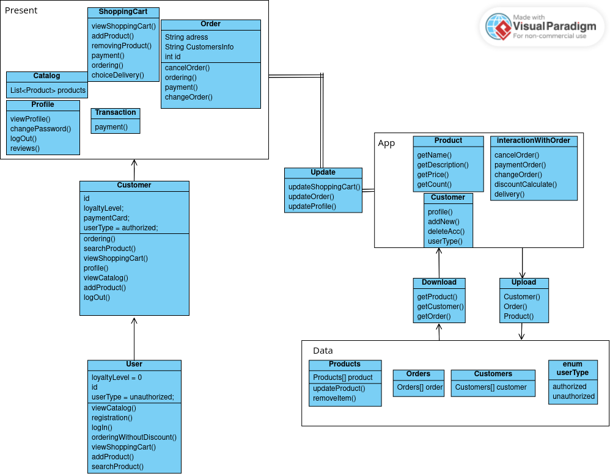
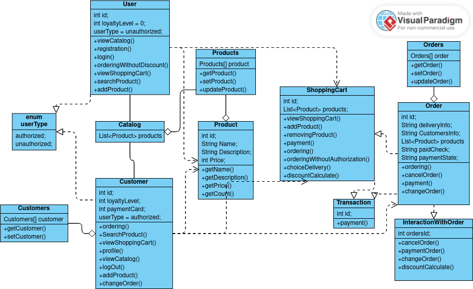

## Компоненты маркетплейса
### Present
### покупатель может видеть каталог товаров, 
### свою корзину, информацию по заказу, информацию профиля если он авторизован
### оформлять и оплачивать заказ
### APP
### компоненты, с которыми взаимодействовал пользователь взаимодействуют с основным ПО, 
### нам могут выдать позиции товаром, отфильтровать товары, можно изменять текущий заказ, редактировать профиль
### DATA
### таже это ПО взаимодействует и с хранилищем, позволяя идентифицировать пользователя и показать нам нужный товар, 
### там хранится информация обо всём ,пользователи, товары, заказы

## Реализация классов
### у нас есть 2 типа пользователей, User и Customer. 
### User это любой пользователь зашедший на сайт магазина, 
### а Customer авторизован, информация о нем уже хранится в базе магазина, он участвует в программе лояльности,
### может изменить данные профиля, может отредактировать заказ
### и тот и другой могут искать товары, просматривать каталог, набирать товары в корзину, оформлять заказы
### ShoppingCart - корзина товаров. здесь покупатели совершают покупку, оформляя заказ, 
### могут отредактировать свою корзину, увидеть примененные скидки, выбрать доставку
### Order - сформированный заказ из корзины, авторизованный пользователь сможет увидеть его в профиле, отредактировать, 
### отменить через метод profile, также если заказ не был оплачен при оформлении в корзине можно оплатить его 
### позже методом payment
### InteractionWithOrder - базовое взаимодействие с заказом, контракт для класса Order
### Product - товар, хранится в базе товаров Products, выдается при поиске, товар пользователи удалить/добавить в корзину

### для полной реализации нужно добавить поставщика товаров как минимм,
